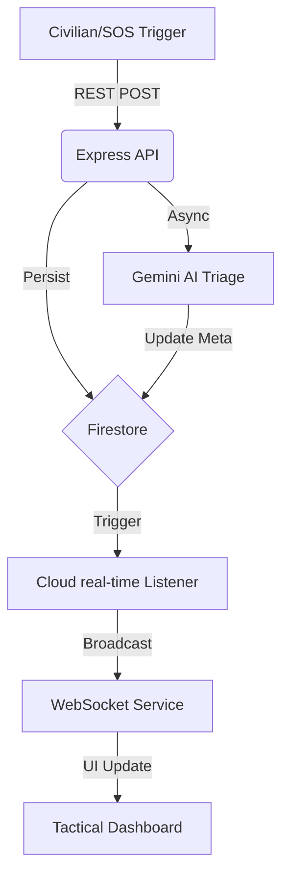

# OmniGuard Architecture 📐

## 1. High-Level Workflow

The OmniGuard system follows an event-driven architecture designed for high-availability and low-latency response.

## 2. Component Stack

### Frontend (Tactical Overlay)
- **Framework**: React 19 (Strict Mode)
- **State Management**: React Hooks + WebSocket Context
- **Map Engine**: Leaflet (via react-leaflet) with Google Maps Tile integration.
- **Styling**: Tailwind CSS v4 (native CSS-first configuration).

### Backend (Command Center)
- **Runtime**: Node.js 20+
- **API**: Express.js with Helmet/CORS protection.
- **Real-time**: Custom WebSocket implementation with role-based routing.
- **Security**: JWT-based authentication with refresh token rotation.

### AI Engine (Gemini Triage)
- **Model**: `gemini-1.5-flash`
- **Role**: Analyzes incident descriptions to determine severity, required resources, and primary category (Medical, Fire, Security).

## 3. Deployment Topology
- **Dashboard**: Hosted on Vercel for global edge delivery.
- **API Server**: Containerized via Docker and deployed to Hugging Face Spaces.
- **Database**: Firebase (Global Region) for real-time synchronization.
