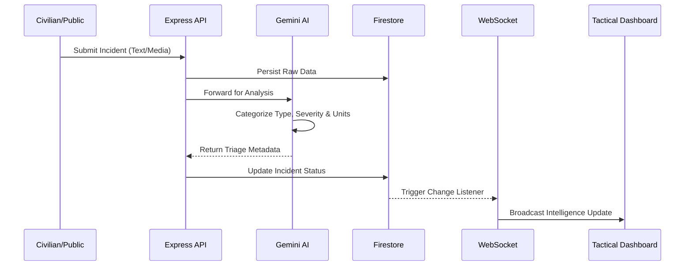

# OmniGuard Technical Architecture 📐

OmniGuard is built on an event-driven, micro-service oriented architecture designed for sub-second latency in crisis scenarios.

## 1. Intelligence & Triage Pipeline

The system utilizes an autonomous triage pipeline powered by **Google Gemini 1.5 Flash**.

## 2. Tactical Routing Engine

The **Tactical Routing Engine** is a client-side specialized logic that optimizes responder deployment.

### Core Logic:
- **Haversine Distance**: Calculates the shortest path across the sphere between Responder GPS and Incident Location.
- **Bearing Calculation**: Determines the precise compass heading (0-360°) for navigational guidance.
- **Dynamic ETA**: Estimated Arrival Time based on a 2.5 min/km response constant with a 1-minute tactical overhead.

## 3. Technology Stack

### Frontend (Mission Control)
- **Engine**: React 19 (Strict Mode) + Vite
- **Maps**: `react-leaflet` with custom high-contrast tactical tile layers.
- **Navigation**: Custom Geospatial Utility Suite (`getDistance`, `getBearing`).
- **Styling**: Tailwind CSS v4 + Framer Motion (for fluid tactical overlays).

### Backend (Command Center)
- **Runtime**: Node.js 20 (LTS)
- **Real-time**: Custom WebSocket implementation with Role-Based filtering.
- **Security**: SHA-256 password hashing + JWT-based RBAC.
- **Database**: Firebase Firestore (Real-time synchronization layer).

## 4. System Access & Test Credentials
To verify role-specific functionality, use the following pre-seeded test accounts. Authenticate via the **Staff Login** section on the mission-critical portal.

| Role | User ID (Email) | Access Code (Password) | Permissions |
| :--- | :--- | :--- | :--- |
| **Admin Strategist** | `coordinator@omniguard.io` | `omni2024!` | Full Command, Global Analytics, Team Management |
| **Fire Team Lead** | `fire_commander@omniguard.io` | `resp2024!` | Fire Suppression Dashboard |
| **Crime Team Lead** | `crime_chief@omniguard.io` | `resp2024!` | Security Task Force View |
| **Disaster Lead** | `disaster_lead@omniguard.io` | `resp2024!` | Bio-Hazard / Disaster Command |
| **Medic Unit M-1** | `medic1@omniguard.io` | `resp2024!` | Medical Response Dashboard |

---
© 2026 OmniGuard Intelligence Systems
